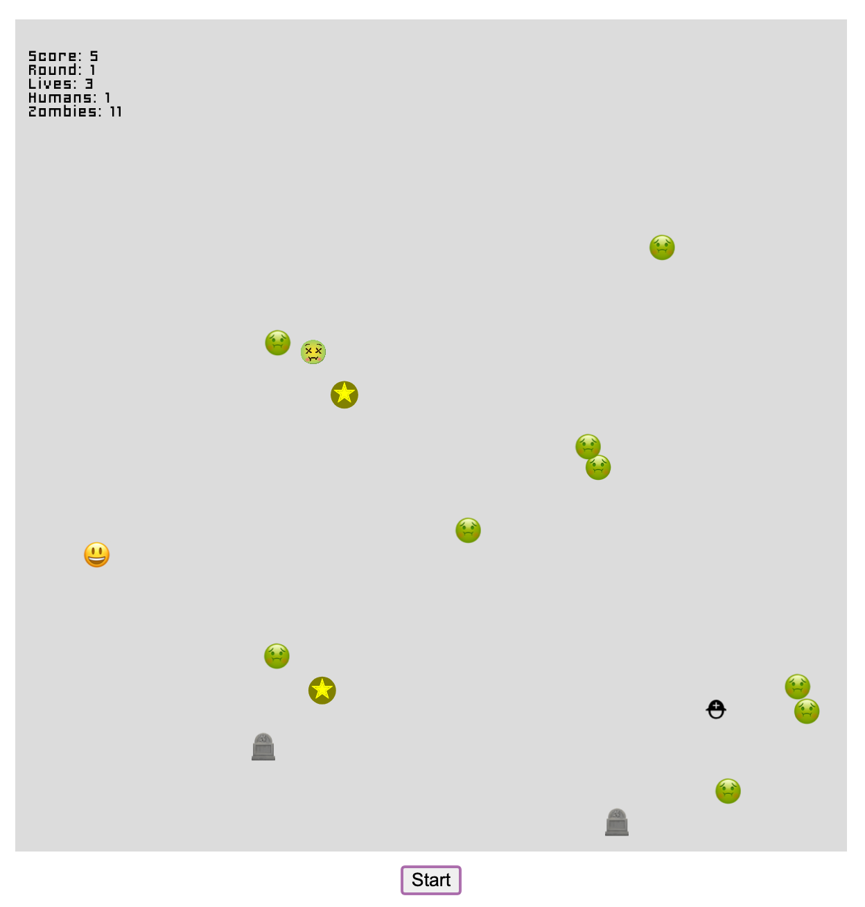

# NOVA ZOMBIE SIMULATOR

A game in p5js designed by my son, coded by us (with LLM assists)

## Publishing

`npm run deploy` builds and publishes to GitHub Pages. Before building, `predeploy` auto-bumps the version:

- `scripts/bump-version.js` reads commit messages since the last release tag and picks a bump level from [Conventional Commits](https://www.conventionalcommits.org/): `feat:` → minor, `fix:`/other → patch, `!:` or `BREAKING CHANGE` → major.
- It commits the bump (`chore(release): vX.Y.Z`) and creates an annotated tag — both local only.
- After deploying, push the release yourself: `git push --follow-tags`.
- Nothing to release (no commits since the last tag)? The script skips the bump and deploy continues as-is.

Current version is shown in-game: bottom-right corner of the title screen, and in the HELP overlay (press `h`).

## Roadmap

- other graphics? This is more an Anthony concern, but he does love emojis
- soldiers shoot bullets, not kill-on-contact
- extra lives, mechanical tweaks
- power-packs that give temporary invulnerability
- better help screen
  - keys, invuln when starting
  - doctors sleep after heal
- more visual on things
  - invulnerability period
  - sleeping doctors
  - bullets for soldiers?
- dark playfield instead of light?
  - I like the title screen better than the playscreen hah hah hah

## p5Play

- https://p5play.org/
- https://p5play.org/docs/index.html (API reference)
- https://openprocessing.org/user/350295?view=sketches&o=48

- https://github.com/quinton-ashley/p5play
- https://discord.gg/EJwnJATmj7
- https://github.com/quinton-ashley/mie
- 

## audio

Bone Crunch by Clearwavsound -- https://freesound.org/s/524609/ -- License: Attribution 3.0

wilhelm_scream.wav by Syna-Max -- https://freesound.org/s/64940/ -- License: Attribution NonCommercial 4.0

Layered Gunshot 7.wav by Xenonn -- https://freesound.org/s/128297/ -- License: Creative Commons 0

Carpenter meets Tron Seq (120 BPM).wav by Xinematix -- https://freesound.org/s/262442/ -- License: Attribution 4.0

Loopy Thing.wav by jarethorin -- https://freesound.org/s/425941/ -- License: Creative Commons 0

Tremolo Strings 2 by nomiqbomi -- https://freesound.org/s/578581/ -- License: Creative Commons 0

Bite (Cartoon Style) by Jofae -- https://freesound.org/s/353067/ -- License: Creative Commons 0

Nom Noise by TheDragonsSpark -- https://freesound.org/s/543386/ -- License: Attribution 4.0

nom ! by chestnutjam -- https://freesound.org/s/399289/ -- License: Creative Commons 0

Sound Effect by <a href="https://pixabay.com/users/fredchaferfrommedia-29969733/?utm_source=link-attribution&utm_medium=referral&utm_campaign=music&utm_content=120135">James White</a> from <a href="https://pixabay.com/sound-effects//?utm_source=link-attribution&utm_medium=referral&utm_campaign=music&utm_content=120135">Pixabay</a>

## other resources

- https://www.dafont.com/charriot-deluxe.font
  - as seen @ https://glicpixxx.love/
  

## uses P5.js-vite Starter Template 🚀

[Vite](https://vitejs.dev/) starter template to scaffold a new [p5.js](https://p5js.org) project.
